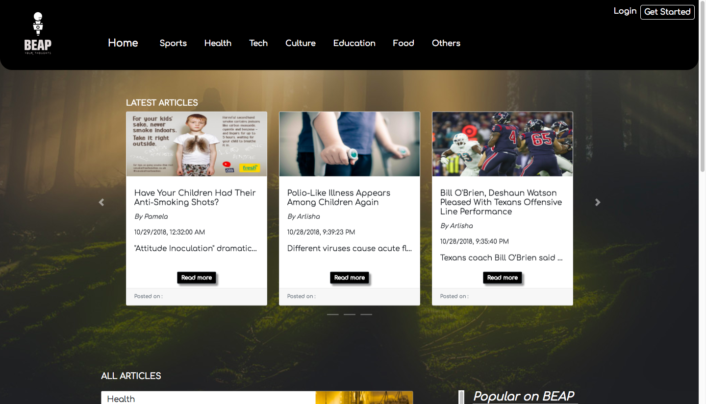

## :speech_balloon: :speech_balloon: :speech_balloon: :speech_balloon: B.E.A.P-Article-Blog-Page :speech_balloon: :newspaper: :speech_balloon: :speech_balloon:
* **Purpose of the app:** 
   This app was created to encourage users to explore their own ideas. It gives them an opportunity to find a platform to share their ideas publicly. In addition, rather than hire a technical writer or journalist, this app also allows users to create their own news articles on our website “B.E.A.P Your Thought”. 
* **How to use:**
   Users must create a login in order to contribute to the web application. Guests are not allowed to create an article. After signing up, the user has the option to create an article, view their previous articles and view the most recent articles of the web application. If the user decides to create a new article, it will be placed in rotation to be featured on the home page as recent article. Users also have the ability to like and comment on articles posted by other users.
* **Features on the app:**
    The most popular articles are featured on the home page. The popular articles are graded by the number of likes the users and guests have given the article. The number of likes are not limited. While on the home page guest and users can sort through articles by the topics, such as Health, Sports, Food, Culture, etc. At any time, the guest or user may return to the home page by clicking the B.E.A.P logo. In order to exit, the user must sign-out under the profile tab. 

## Site Preview

   
## Live link: 
- ["B.E.A.P Your Thoughts"](http://beap.surge.sh/)

## Introduction video of the project: 
- https://youtu.be/_TSqOdyXeng

## This site was built by
- [Beyza Kilickol](https://github.com/beyzakilickol) 
- [Pamela Hutchinson](https://github.com/pamelahutchinson) 
- [Emre Akurek](https://github.com/emreyeprem) 
- [Arlisha Hayles](https://github.com/Arlisha2019)

## Database: 
This project was built using "Firebase Real Time Database"

## Featured programs: 
- HTML, CSS, Bootstrap, JavaScript

    
